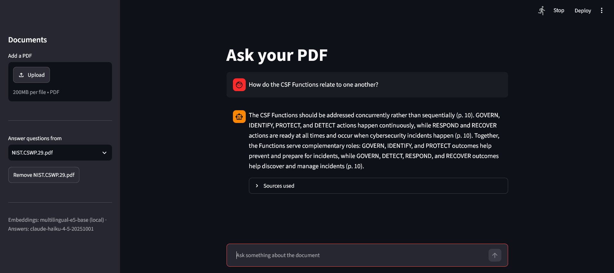
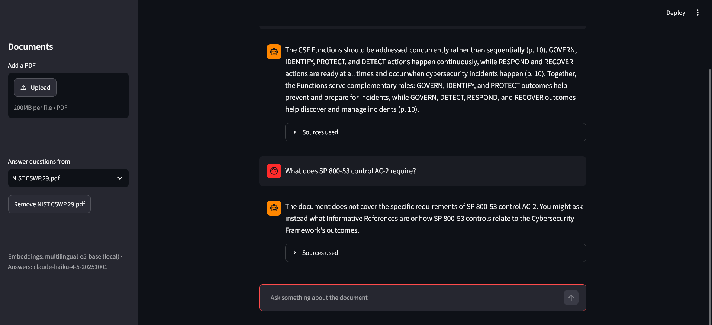

# Ask your PDF

Upload a PDF, ask questions in plain language, and get answers drawn only
from the document — each one carrying the page it came from.

Built without a RAG framework. Loading, chunking, embedding, storage,
retrieval and prompting are each a separate module, so every design
decision is visible, changeable, and measurable rather than hidden behind
a helper function.



When the document does not cover a question, the app says so instead of
filling the gap:



## Design decisions

**Local embeddings instead of a hosted API.** Hosted embedding models are
tuned primarily on English and the gap shows elsewhere. Testing
`text-embedding-3-small` against local multilingual models on Turkish
text, the hosted model ranked an unrelated control sentence above the
correct answer on two independent corpora. `multilingual-e5-base` runs on
CPU, costs nothing per query, and the evaluation below shows where that
choice pays for itself.

**Asymmetric query/passage prefixes.** The e5 family is trained so that a
question and a document are encoded differently. `embedder.py` applies
`query:` and `passage:` separately, and skips them for models outside the
family so that comparisons stay fair.

**Citations use printed page labels, not file positions.** A document
with front matter numbered i–iv puts printed page 5 at file position 10,
so citing the file position sends the reader to the wrong page. Declared
page labels are used when a PDF has them. Most do not — including both
documents this was tested against — so the number printed on each page is
read off the page itself and accepted only when it appears on most pages
and increases monotonically. Failing both, the file position stands in.

**Deterministic chunk IDs.** Each chunk is identified by a SHA-256 hash
of source, page and content. Re-indexing an unchanged document embeds
nothing; an edited passage is correctly treated as new content.

**Grounding enforced in the prompt, not in sampling.** Sampling
parameters were removed from the Messages API in 2026, so pinning
temperature to zero is no longer possible — and was never what prevented
hallucination. The four rules in the system prompt are.

**A refusal path that never calls the LLM.** If nothing clears the
distance threshold, the app answers "not in this document" without
spending a token. Cheaper, and honest by construction.

## Retrieval evaluation

Retrieval either finds the right passage or it does not, and that is
measurable without involving the LLM. Keeping the two separate means a
wrong answer can be traced to the search or to the prompt, rather than
guessed at.

Two documents, each with six answerable questions and two controls,
matched category for category: one phrased in the source's own wording,
one paraphrase, one spanning a page break, one buried detail, one
reference identifier, one vocabulary gap. English: NIST CSWP 29
(Cybersecurity Framework 2.0), 32 pages, 123 chunks. Turkish: Labour Law
No. 4857, 55 pages, 262 chunks.

| Model | recall@3 (EN) | MRR (EN) | recall@3 (TR) | MRR (TR) |
| --- | --- | --- | --- | --- |
| `intfloat/multilingual-e5-base` | **0.833** | **0.722** | **0.667** | **0.444** |
| `sentence-transformers/all-MiniLM-L6-v2` | 0.667 | 0.556 | 0.333 | 0.250 |

**The multilingual model earns its size in Turkish, not in English.** The
gap between the two models is modest on the English document and doubles
on the Turkish one, where MiniLM finds the right page for only a third of
the questions. Measuring in English alone would have left a 1.1 GB model
looking like an expensive tie with a 90 MB one.

**Reference identifiers are not retrievable by meaning, in either
language.** Neither model finds `SP 800-161r1` in English, nor the
cross-reference to Law No. 1475 in Turkish. The failure is structural
rather than linguistic: embeddings encode meaning, and an identifier
carries none. Closing this needs hybrid keyword search.

**Paraphrase degrades but does not break.** A question in everyday
Turkish about notice periods reaches the right page at rank 3, where the
equivalent English question ranks 1.

The comparison *across* languages is not controlled: the Turkish document
is twice the length and from a different domain, so a lower Turkish score
cannot be attributed to language alone. What the table does support is
the comparison between models on each document, which is what the model
choice rests on.

Reproduce with:

```bash
python -m eval.run --pdf data/<document>.pdf --questions eval/questions_en.json \
    --models intfloat/multilingual-e5-base sentence-transformers/all-MiniLM-L6-v2 \
    --k 3 --verbose
```

## Setup

```bash
git clone https://github.com/<user>/pdf-qa-assistant.git
cd pdf-qa-assistant

python -m venv .venv
.venv\Scripts\activate          # Windows
source .venv/bin/activate       # macOS / Linux

pip install torch --index-url https://download.pytorch.org/whl/cpu
pip install -r requirements.txt

cp .env.example .env            # then add an Anthropic API key
streamlit run app.py
```

Installing the CPU build of torch first keeps the download near 200 MB
instead of pulling a CUDA build. The embedding model (~1.1 GB) downloads
on first run and is cached afterwards.

## Usage

Upload a PDF in the sidebar and index it, then ask questions in the chat.
Each answer carries page references, and the sources behind it can be
expanded to check them.

Two command-line tools support the work:

```bash
python peek.py data/doc.pdf          # chunk statistics and page labels
python peek.py data/doc.pdf 70 73    # read chunks 70-72 in full
python -m eval.run --help            # retrieval evaluation
```

`peek.py` exists because chunking decisions are best judged by reading
the output. Its overlap figure is the quickest way to catch a splitter
that has started duplicating content.

## Project layout

```
app.py              Streamlit interface — no retrieval logic
peek.py             dev tool: chunk statistics and inspection
rag/config.py       every tunable value, with the measurements behind it
rag/loader.py       PDF → text, page by page, with printed page labels
rag/chunker.py      cleaning, running-header removal, splitting, IDs
rag/embedder.py     local model wrapper with e5 prefixes
rag/store.py        ChromaDB: idempotent ingest, cosine search
rag/answer.py       grounded prompt and LLM call
eval/               recall@k and MRR, one question set per language
```

Replacing Streamlit with a Telegram bot or an HTTP API would touch
`app.py` and nothing else.

## Known limitations

Measured rather than assumed. Each of these is a real result from the
evaluation above.

- **The distance threshold does not do what it looks like it does.**
  Correct hits (0.100–0.178) and questions the document cannot answer
  (0.153–0.223) overlap. A control question about cybersecurity budgets
  lands at 0.153 because budgets genuinely are discussed, just not with
  the figure asked for. Distance measures topical proximity, not whether
  an answer is present, so no single value separates the two. Refusal is
  enforced in the system prompt; the threshold remains only as a valve
  for unrelated queries. The overlap holds in Turkish too: 0.099–0.163
  against 0.133–0.135.
- **Threshold values are model-specific.** On the same English questions
  e5's correct hits land in 0.100–0.178 and MiniLM's in 0.349–0.524. A
  threshold tuned for one rejects everything under the other.
- **Reference numbers and cross-citations are not retrievable.** Measured
  in both languages; the clearest argument for adding hybrid search.
- **Vocabulary gaps are not closed.** A question about "hiring and
  staffing" fails to reach the document's "human resources practices".
- **Scanned PDFs are rejected.** No text layer, so they need OCR first.
- **Chunks never span a page boundary,** so a fact split across a page
  break may be retrieved incompletely.
- **PDF extraction occasionally inserts a space inside a word**
  ("O rganizational"). A single stray space cannot be told from a real
  one without a dictionary, so these survive cleaning.
- **Running-header removal is a heuristic.** Lines repeating on most
  pages are dropped as page furniture; a genuine content line repeated
  that often would go with them.
- **Page-label detection is a heuristic.** Validated for coverage and
  monotonicity before being trusted, but a document printing no page
  numbers falls back to file position.

## Cost

Embedding runs locally and costs nothing. Only answer generation is
billed — the retrieved excerpts plus the question, per query, against
`claude-haiku-4-5`. Queries that clear no chunk never reach the API.
